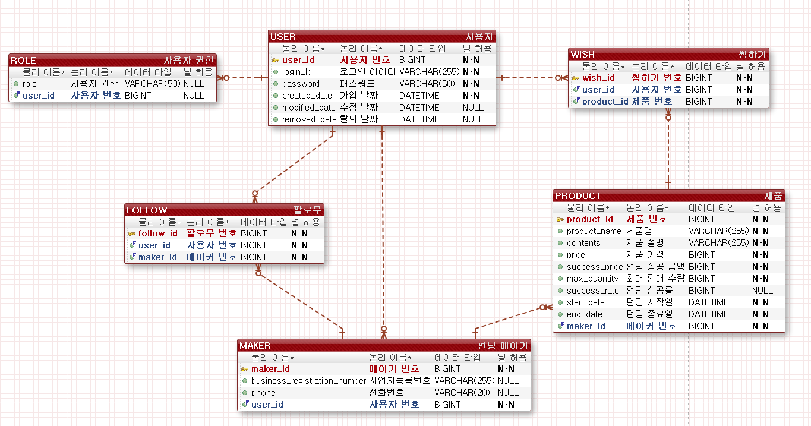

# 펀딩 서비스 만들기 

스프링 부트를 활용한 서버 API 기반 펀딩 서비스입니다.

## 프로젝트 기능 및 설계
- 회원 가입 기능
  - 사용자는 회원 가입을 해야 서비스를 이용할 수 있다.
  - 기본적으로 회원 가입을 한 모든 사용자는 펀딩 참여가 가능하다.

- 펀딩 메이커 신청 기능
  - 회원 가입한 사용자는 사업자 혹은 개인으로 펀딩 메이커 신청을 할 수 있다. 

- 로그인 기능
  - 사용자는 로그인을 할 수 있다.
  - 로그인 시 회원가입 때 사용한 아이디와 패스워드가 일치해야 한다. 

- 제품 등록 기능
  - 펀딩 메이커는 제품을 등록할 수 있다.
  - 펀딩 메이커는 제품명, 제품 설명, 최대 판매 수량, 펀딩 성공 금액, 펀딩 기간을 설정해야 한다.
  - 제품명은 unique 해야 한다. 
  - 펀딩 참여자 명단, 펀딩 성공률 필드는 펀딩 참여 정도에 따라 업데이트 된다.  

- 제품 목록 및 상세 정보 보기 기능
  - 사용자는 펀딩 예정, 펀딩 진행 중, 펀딩 종료 목록을 조회할 수 있다.
  - 펀딩 예정 목록은 펀딩 시작알 기준으로 정렬된다.
  - 펀딩 진행 중 목록은 펀딩 시작일 기준, 펀딩 성공률 기준으로 정렬할 수 있다.
  - 펀딩 종료 목록은 펀딩 종료일 기준으로 정렬된다.
  - 사용자는 제품별 상세 정보를 볼 수 있다. 

- 펀딩 참여 및 취소
  - 사용자는 펀딩 참여와 취소 신청을 할 수 있다.
  - 이미 펀딩 참여를 신청한 사람은 두 번 신청할 수 없다.
  - 펀딩 취소 후 재참여는 가능히다.

- 결제 기능
  - 펀딩이 성공한 제품만 결제 요청을 할 수 있다.
  - 결제상태를 변경하는 Stub API 수준으로 처리한다.

- 찜하기 기능
  - 사용자는 제품 목록을 보고 원하는 제품을 찜하기 및 찜하기 취소를 할 수 있다.

- 팔로우 기능
  - 사용자는 펀딩 메이커를 팔로우할 수 있다.
 
## ERD

## Trouble Shooting
[go to the trouble shooting section](TROUBLE_SHOOTING.md)

### Tech Stack
- Java
- SpringBoot
- MySQL
- JPA
- JWT
- Spring Security
- Swagger
